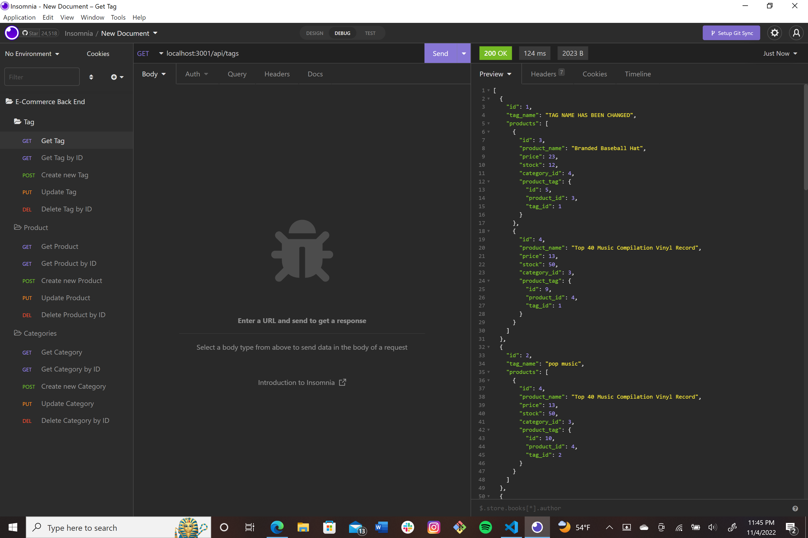

# Ecommerce Backend

The goal of this project was to build the back end for an e-commerce buisness using Express API and Sequelize with a sql database.
The user can perform operations on products, tags, and catergories to suit their buisness.

This repository utilizes
* JavaScript
* Node
* npm
* MySQL
* Sequelize

[Video](https://drive.google.com/file/d/1igvRYhMDQkZI4DhJKViT-1mP5wNefpmW/view)

## Installation 

Install node. Intall dependencies with the following command.
```sh
npm install
```
Install mysql. Then run 
```sh
source db/schema.sql
```
from within the mysql shell to create the database.

A .env file with the db name and your username and pw, which sequelize will use to connect is required.

To seed the database
```sh
npm run seed
```

## Usage 
To start the server
```sh
npm server.js
```
You can then test the various requests on your API client of choice or browser.

## [Demo](https://drive.google.com/file/d/18XiU4EFWuvPXROHxIM8as6zDmd6V1eSd/view)


## Code Snippets

```JavaScript
router.get('/', async (req, res) => {
  try {
    const catData = await Category.findAll({
      include: [{ model: Product }],
    });

    res.status(200).json(catData);
  } catch (err) { res.status(500).json(err); }
});
```

## Author Links
[LinkedIn](https://www.linkedin.com/in/alexis-zaragoza-5baa51242/)
[GitHub](https://github.com/turtle2001)